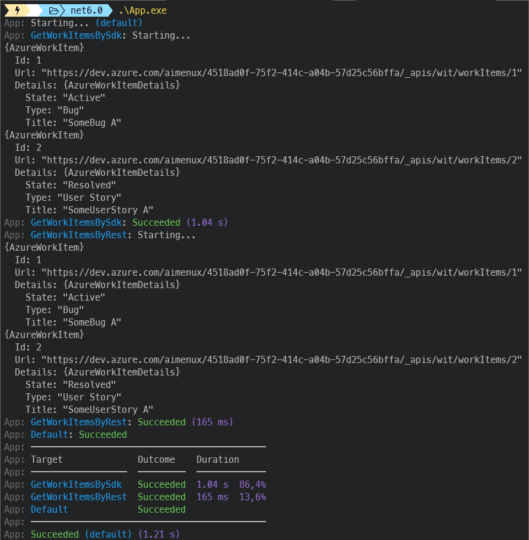

# AzureWorkItemsClientDemo
```
Using various ways in order to get info about azure work items
```

In this demo, i m using two ways in order to get info about azure work items.
>
> :one: Using [SDK LIBs](https://docs.microsoft.com/en-us/azure/devops/integrate/concepts/dotnet-client-libraries?view=azure-devops)
>
> :two: Using [REST APIs](https://docs.microsoft.com/en-us/rest/api/azure/devops)
>
>
Filtering work items is done via a configurable query. If missing in config file, this query is by default used :
>

```sql
Select [System.Id], [System.Title], [System.State] 
From WorkItems 
Where [State] <> 'Closed' 
Order by [System.CreatedDate] ASC
```

>
> 
>

**`Tools`** : vs22, net 6.0, bullseye
